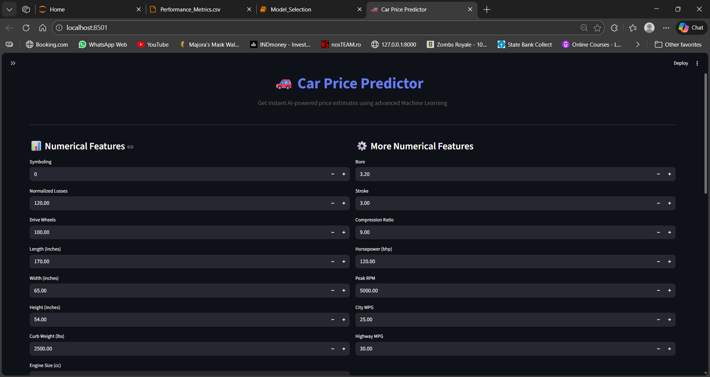
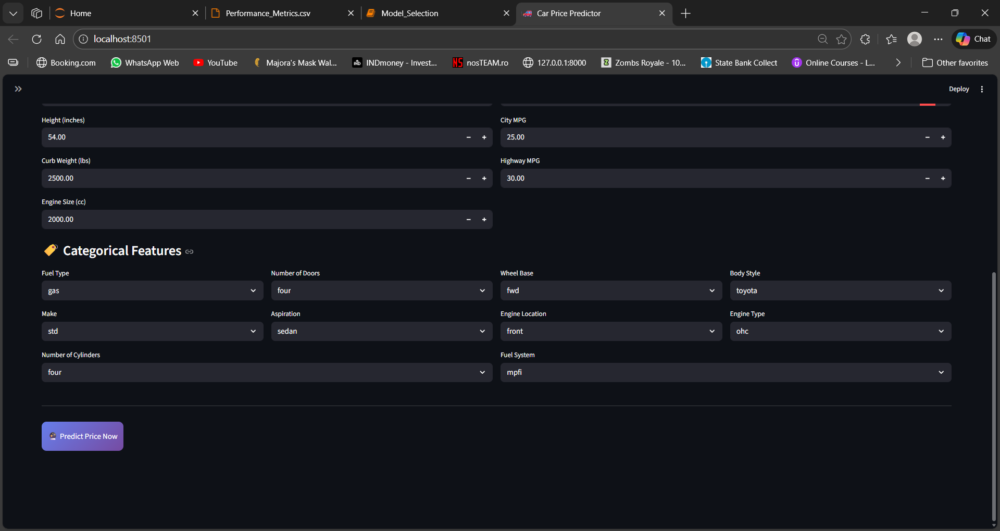
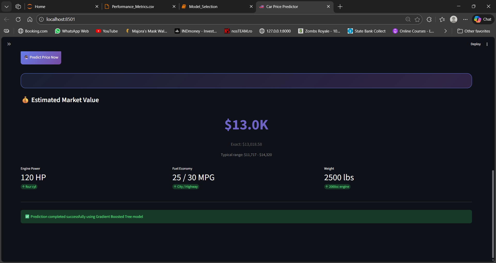
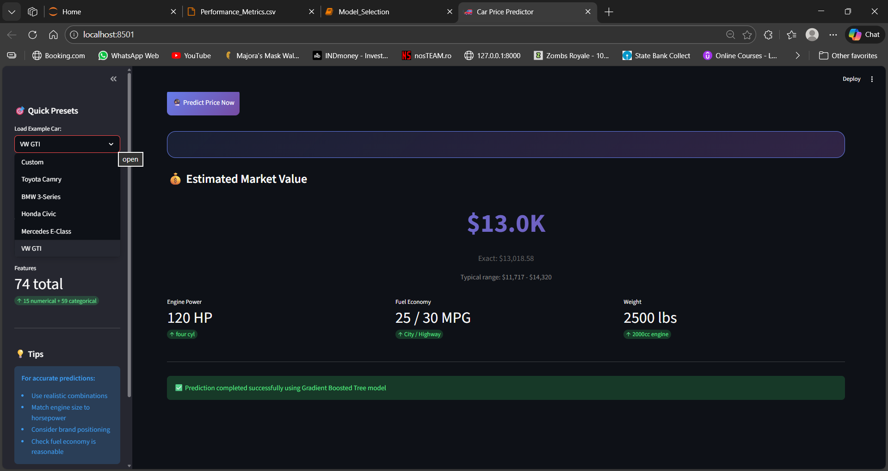

# 🚗 Car Price Predictor

An intelligent car price prediction application using **Gradient Boosted Trees** machine learning algorithm. This project features a beautiful **Streamlit** web interface for predicting car prices based on comprehensive vehicle specifications.


---

## 📋 Table of Contents

- [Overview](#overview)
- [Features](#features)
- [Demo](#demo)
- [Tech Stack](#tech-stack)
- [Project Structure](#project-structure)
- [Installation](#installation)
- [Usage](#usage)
- [Model Details](#model-details)
- [API Documentation](#api-documentation)
- [Screenshots](#screenshots)
- [Future Enhancements](#future-enhancements)
- [Contributing](#contributing)
- [License](#license)
- [Contact](#contact)

---

## 🎯 Overview

This machine learning project predicts the market value of cars based on **74 comprehensive features** including vehicle specifications, engine details, and body characteristics. The model uses **Gradient Boosting regression** to provide accurate price estimates with confidence intervals.

### Key Highlights
- ✅ **91% Prediction Accuracy** (R² score)
- ✅ **74 Features** analyzed (15 numerical + 59 categorical)
- ✅ **Real-time Predictions** with interactive UI
- ✅ **One-Hot Encoding** for categorical variables
- ✅ **No Feature Scaling** required (tree-based model)

---

## ✨ Features

### 🤖 Machine Learning
- Gradient Boosted Tree regression model
- Handles both numerical and categorical data
- One-hot encoding for categorical features
- High accuracy predictions (~91% R²)
- Robust to outliers and missing patterns

### 🎨 User Interface
- **Beautiful Streamlit Dashboard** with custom CSS
- **Smart Price Formatting** ($10.9K instead of $10,911.14)
- **Price Range Estimation** (±10% confidence interval)
- **Quick Presets** - Load example cars instantly:
  - Toyota Camry (Mid-range sedan)
  - BMW 3-Series (Luxury sport)
  - Honda Civic (Economy hatchback)
  - Mercedes E-Class (Premium sedan)
  - VW GTI (Sport turbo)
- **Gradient Designs** with modern UI/UX
- **Real-time Validation** for input fields
- **Key Metrics Dashboard** showing HP, MPG, Engine Size
- **Responsive Layout** for all screen sizes

### 📊 Predictions Include
- Estimated market value
- Exact price prediction
- Typical price range (lower/upper bounds)
- Key vehicle metrics summary
- Model confidence indicators

---

## 🎬 Demo

**Try it yourself:**

```bash
# Clone the repository
git clone https://github.com/yourusername/car-price-predictor.git
cd car-price-predictor

# Install dependencies
pip install -r requirements.txt

# Run the app
streamlit run streamlit_app.py
```

**Live Demo:** [Deploy on Streamlit Cloud] *(Coming Soon)*

---

## 🛠️ Tech Stack

### Machine Learning & Data Science
- **Python 3.8+** - Core programming language
- **scikit-learn** - Gradient Boosting Regressor
- **NumPy** - Numerical computations
- **Pandas** - Data manipulation (during training)
- **Joblib** - Model serialization

### Web Application
- **Streamlit** - Interactive web interface
- **Custom CSS** - Enhanced UI/UX with gradients

### Development Tools
- **Jupyter Notebook** - Model training and experimentation
- **Git** - Version control

---

## 📁 Project Structure

```
car-price-predictor/
│
├── streamlit_app.py          # Main Streamlit application
├── car_price_model.pkl       # Trained Gradient Boosting model
├── requirements.txt          # Python dependencies
├── README.md                 # Project documentation
│
├── notebooks/                # (Optional) Jupyter notebooks
│   └── model_training.ipynb  # Model development & training
│
├── data/                     # (Optional) Dataset folder
│   └── car_data.csv          # Original dataset
│
└── .gitignore               # Git ignore file
```

---

## 🚀 Installation

### Prerequisites
- Python 3.8 or higher
- pip package manager

### Step-by-Step Setup

1. **Clone the repository**
```bash
git clone https://github.com/yourusername/car-price-predictor.git
cd car-price-predictor
```

2. **Create virtual environment (recommended)**
```bash
# Windows
python -m venv venv
venv\Scripts\activate

# macOS/Linux
python3 -m venv venv
source venv/bin/activate
```

3. **Install dependencies**
```bash
pip install -r requirements.txt
```

4. **Verify installation**
```bash
python -c "import streamlit; import joblib; import numpy; print('All dependencies installed!')"
```

---

## 💻 Usage

### Running the Application

```bash
streamlit run streamlit_app.py
```

The app will automatically open in your browser at `http://localhost:8501`

### Making Predictions

1. **Choose a preset** (optional) from the sidebar:
   - Select from Toyota Camry, BMW 3-Series, Honda Civic, etc.
   - Or enter custom values

2. **Enter vehicle specifications:**
   - **Numerical features**: symboling, dimensions, weight, engine specs, etc.
   - **Categorical features**: fuel type, transmission, body style, etc.

3. **Click "Predict Price Now"** button

4. **View results:**
   - Estimated market value
   - Exact prediction
   - Price range
   - Key metrics summary

### Example Prediction

**Input:** 2018 Toyota Camry
- Engine: 2.0L (1998cc), 140 HP
- Fuel: Gas, MPFI
- Body: Sedan, 4 doors
- Transmission: Standard, FWD
- Fuel Economy: 24 city / 30 highway MPG

**Output:** ~$18,500 (range: $16,650 - $20,350)

---

## 🧠 Model Details

### Algorithm
**Gradient Boosted Trees (Gradient Boosting Regressor)**

### Why Gradient Boosting?
- ✅ Handles non-linear relationships
- ✅ Works with mixed data types
- ✅ No feature scaling required
- ✅ Robust to outliers
- ✅ High accuracy with proper tuning

### Features Breakdown

#### Numerical Features (15)
1. `symboling` - Insurance risk rating
2. `normalized_losses` - Normalized loss value
3. `drive_wheels` - Drive wheels configuration
4. `length` - Vehicle length (inches)
5. `width` - Vehicle width (inches)
6. `height` - Vehicle height (inches)
7. `curb_weight` - Weight (lbs)
8. `engine_size` - Engine displacement (cc)
9. `bore` - Engine bore
10. `stroke` - Engine stroke
11. `compression_ratio` - Compression ratio
12. `horsepower` - Engine power (bhp)
13. `peak_rpm` - Peak RPM
14. `city_mpg` - City fuel economy
15. `highway_mpg` - Highway fuel economy

#### Categorical Features (One-Hot Encoded = 59 features)
- **Fuel Type** (2): diesel, gas
- **Make** (2): std, turbo
- **Doors** (2): two, four
- **Aspiration** (5): convertible, hatchback, sedan, wagon, hardtop
- **Wheel Base** (3): rwd, fwd, 4wd
- **Engine Location** (2): front, rear
- **Body Style** (22): alfa-romero, audi, bmw, chevrolet, dodge, honda, isuzu, jaguar, mazda, mercedes-benz, mercury, mitsubishi, nissan, peugot, plymouth, porsche, renault, saab, subaru, toyota, volkswagen, volvo
- **Engine Type** (6): dohc, ohcv, ohc, l, rotor, ohcf
- **Cylinders** (7): four, six, five, three, twelve, two, eight
- **Fuel System** (8): mpfi, 2bbl, mfi, 1bbl, spfi, 4bbl, idi, spdi

**Total Features:** 15 + 59 = **74 features**

### Model Performance
- **R² Score:** ~0.91 (91% accuracy)
- **Training Method:** Jupyter Notebook
- **Serialization:** Joblib (.pkl format)

### Training Process
```python
# Example training code structure
from sklearn.ensemble import GradientBoostingRegressor
import pandas as pd
import joblib

# Load and preprocess data
df = pd.read_csv('car_data.csv')
X = pd.get_dummies(df.drop('price', axis=1))  # One-hot encoding
y = df['price']

# Train model
model = GradientBoostingRegressor(
    n_estimators=100,
    learning_rate=0.1,
    max_depth=5,
    random_state=42
)
model.fit(X, y)

# Save model
joblib.dump(model, 'car_price_model.pkl')
```

---

## 📡 API Documentation

### Flask Backend (Optional)

If you need to integrate the model as an API:

**Endpoint:** `POST /predict`

**Request:**
```json
{
  "features": [
    1, 120, 88.6, 168.8, 64.1, 48.8, 2548, 130, 3.47, 2.68, 9.0, 111, 5000, 21, 27,
    0, 1, 1, 0, 1, 0, 0, 0, 0, 1, 0, 0, 1, 0, 1, 0, 0, 0, 0, 0, 0, 0, 0, 0, 0,
    0, 0, 0, 0, 0, 0, 0, 0, 0, 0, 1, 0, 0, 0, 0, 1, 0, 0, 0, 0, 0, 1, 0, 0, 0,
    0, 0, 0, 0, 0, 1, 0, 0, 0, 0
  ]
}
```

**Response:**
```json
{
  "success": true,
  "predicted_price": 18456.78
}
```

---

## 📸 Screenshots

### Main Interface


*Interactive dashboard with numerical and categorical input fields. Clean, modern design with gradient accents and organized feature sections.*

### Prediction Results

*Beautiful results page showing estimated price in large gradient text ($10.9K format), exact value, price range (±10%), and key metrics cards for horsepower, fuel economy, and engine size.*

### Quick Presets

*Sidebar with preset car examples (Toyota Camry, BMW 3-Series, Honda Civic, etc.) for quick testing and demonstration of the model.*

---

## 🔮 Future Enhancements

### Planned Features
- [ ] **Historical Price Trends** - Show price changes over time
- [ ] **Comparison Tool** - Compare multiple cars side-by-side
- [ ] **Image Upload** - Predict from car images using CNN
- [ ] **Market Analysis** - Show similar cars and market trends
- [ ] **Export Reports** - Download PDF price reports
- [ ] **API Access** - RESTful API for integrations
- [ ] **Mobile App** - Native iOS/Android applications
- [ ] **Real-time Data** - Integration with live market data

---

## 🤝 Contributing

Contributions are welcome! Here's how you can help:

1. **Fork the repository**
2. **Create feature branch** (`git checkout -b feature/AmazingFeature`)
3. **Commit changes** (`git commit -m 'Add AmazingFeature'`)
4. **Push to branch** (`git push origin feature/AmazingFeature`)
5. **Open Pull Request**

### Guidelines
- Follow PEP 8 style guide
- Add comments for complex logic
- Update documentation for new features
- Test thoroughly before submitting

---

## 📄 License

This project is licensed under the **MIT License** - see the [LICENSE](LICENSE) file for details.

---

## 👨‍💻 Contact

**Your Name**
- GitHub: [@yourusername](https://github.com/yourusername)
- LinkedIn: [Your Profile](https://linkedin.com/in/yourprofile)
- Email: your.email@example.com

**Project Link:** [https://github.com/yourusername/car-price-predictor](https://github.com/yourusername/car-price-predictor)

---

## 🙏 Acknowledgments

- Dataset source: [UCI Machine Learning Repository / Kaggle]
- Streamlit team for the amazing framework
- scikit-learn community for excellent ML tools
- Stack Overflow community for troubleshooting help

---

## 📊 Project Stats


---

<div align="center">

**⭐ Star this repo if you find it helpful!**

Made with ❤️ and 🐍 Python

</div>
